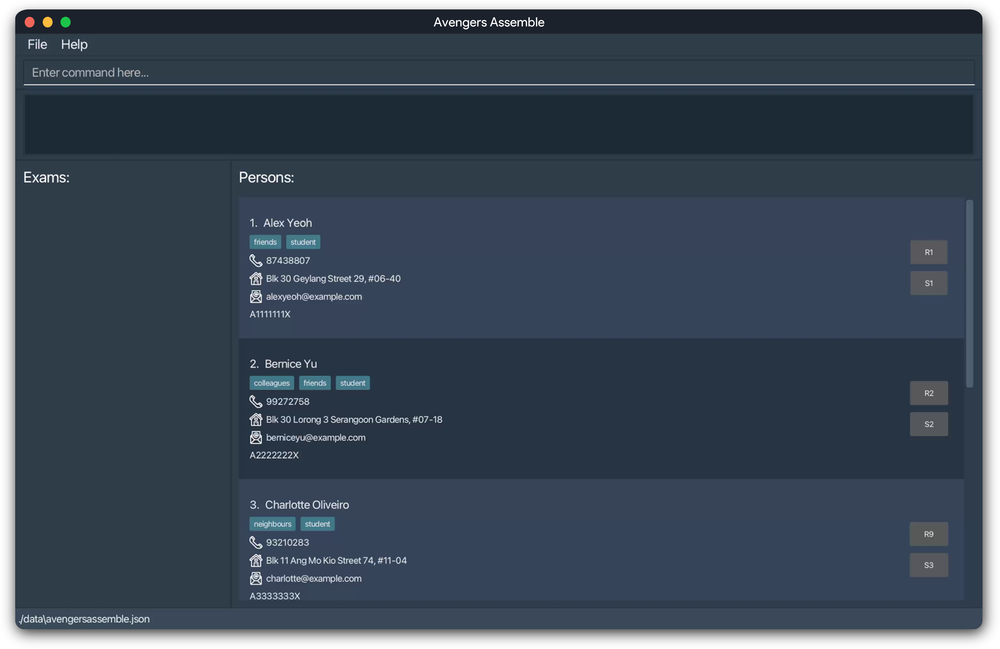
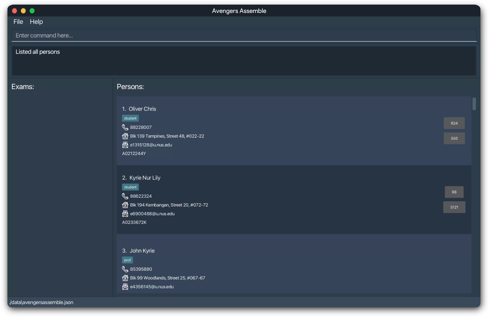
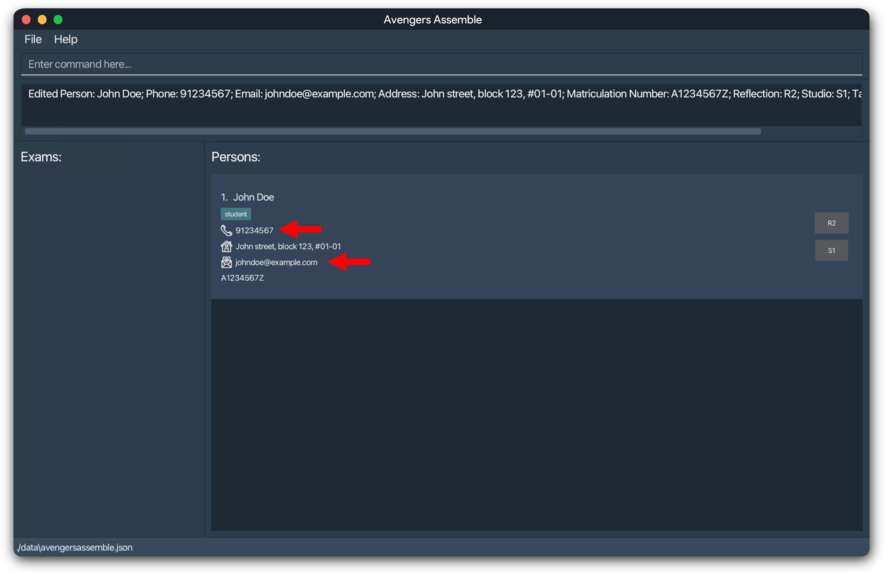
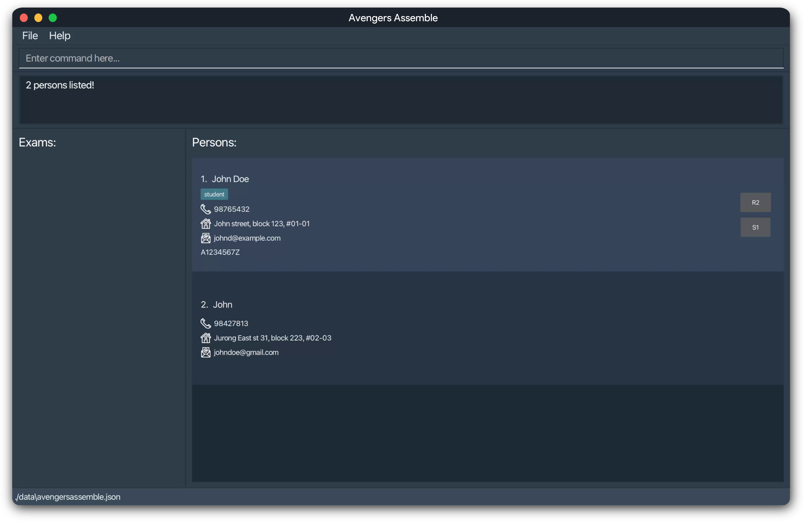
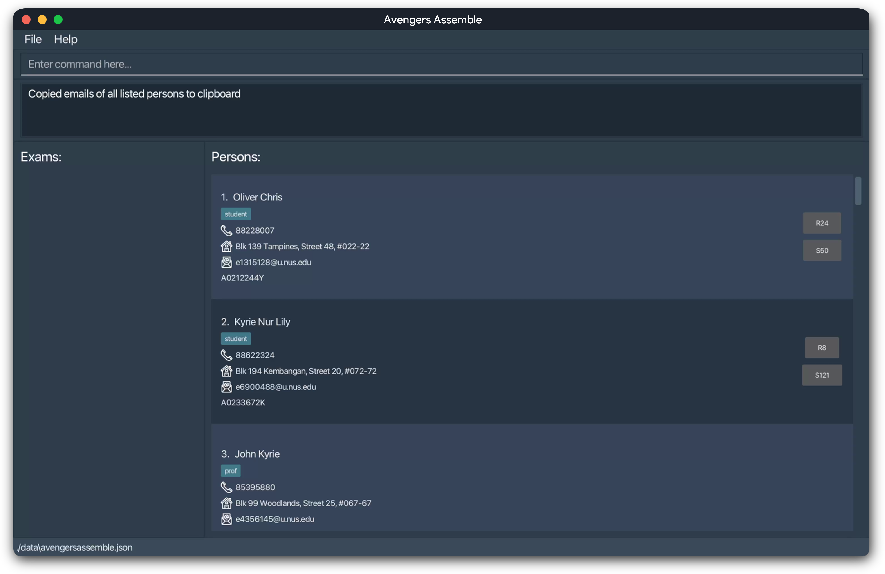
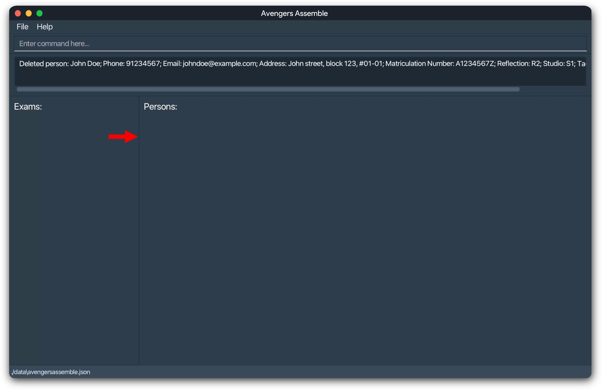
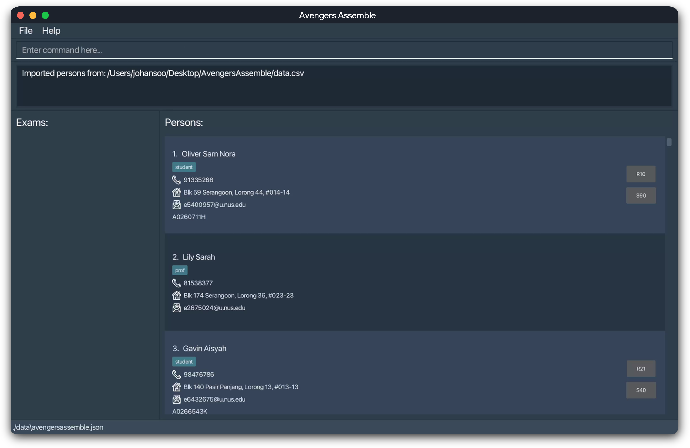

# Avengers Assemble User Guide

Avengers Assemble (AA) is a **desktop app for managing contacts**, meant for use with a Command Line Interface (CLI)
while still having the benefits of a Graphical User Interface (GUI).

The application is designed for **Head Tutors** of the NUS CS1101S Programming Methodology course, who intend to simplify their administrative tasks relating to contact management between students, other teaching assistants, and course instructors.
However, its functions can also be extended to you if you are a head tutor of another course.

Our user guide aims to help you understand how to get started with the application.


We will cover the features in a chronological order, from:
1. Installation, to
2. Simple commands like adding and editing, followed by
3. More advanced commands like filtering and exporting data.

<!-- * Table of Contents -->
<page-nav-print />

--------------------------------------------------------------------------------------------------------------------

## Quick Start

1. Ensure you have `Java 11` or above installed in your computer.

1. Download the latest `avengersassemble.jar` [here](https://github.com/AY2324S2-CS2103T-T10-1/tp/releases/tag/v1.2).

1. Copy the file to the folder you want to use as the _home folder_ for our application.

1. Open a command terminal, `cd` into the folder you put the jar file in, and use the `java -jar avengersassemble.jar` command to run the application.<br>
   ```dtd
    cd <path_to_the_folder_containing_the_jar_file>
    java -jar avengersassemble.jar
    ```
   You should see this when the app starts up. Note how it contains some sample data.<br>

   


1. Refer to the [Features](#features) below for details of each command.

--------------------------------------------------------------------------------------------------------------------

## Features

### Legend
These boxes might offer you additional information of different types:

>**Good to know:**
>I provide you with supporting information.

<box type="info" seamless>

**Important:**
I provide you with more important information that you should know.
</box>

<box type="tip" seamless>

**Tip:**
I provide you with tips to use our app more effectively.
</box>

<box type="warning" seamless>

**Caution:**
I provide you with warnings about potential issues you might face.
</box>


### Getting Help : `help`

Shows you a link to guide you on how to use the application. Click on the link to access the user guide.


Format: `help`
>Note: The application ignores any extraneous parameters as we assume they are typos.

Before we proceed with the commands, here are some important points to note on their formatting. These points will also be repeated in the [command format summary](#command-format-summary) for you to refer to easily at any point in time.

<box type="info" seamless>

**Important:** </br>

* Words in `UPPER_CASE` are the parameters to be supplied by the user.<br>
  > e.g. in `add n/NAME`, `NAME` is a parameter which can be used as `add n/John Doe`.

* Prefixes encased with '[ ]' are optional.
  > e.g. `n/NAME [t/TAG]` can be used as `n/John Doe t/friend` or as `n/John Doe`.

* Prefixes with '…' after them can be used multiple times.
  > e.g. `[t/TAG]…​` can be used as ` ` (i.e. 0 times), `t/friend` (i.e 1 time), `t/friend t/family` etc.

* Parameters can be in any order.<br>
  > e.g. if the command specifies `n/NAME p/PHONE_NUMBER`, `p/PHONE_NUMBER n/NAME` is also acceptable.

* Extraneous parameters for commands that do not take in parameters (such as `help` , `list`, `exit`, `copy`, `export` and `clear`) will be ignored.<br>
  > e.g. if the command specifies `help 123`, it will be interpreted as `help`.

</box>

<box type="warning" seamless>

**Caution:** </br>
* If you are using a PDF version of this document, be careful when copying and pasting commands that span multiple lines as space characters surrounding line-breaks may be omitted when copied over to the application.

</box>

### Adding a Person: `add`

Adds a person to your contact list. The person's details are now stored in the application.

Format: `add n/NAME p/PHONE_NUMBER e/EMAIL a/ADDRESS [t/TAG]… [m/MATRICULATION_NUMBER] [s/STUDIO] [r/REFLECTION]​`

<box type="info" seamless>

**Important:** Each person should have a unique email address. AA does not allow for duplicate email addresses to be added.

</box>

<box type="tip" seamless>

**Tip:** A person can have any number of tags (including 0)
</box>

**Example:**
`add n/John Doe p/98765432 e/johnd@example.com a/John street, block 123, #01-01 m/A1234567Z s/S1 r/R2`<br>


* Adds a contact John Doe with the respective phone number, email and physical addresses, matriculation number, studio group and recitation group.


>Note: The following tags will be automatically added to the person if the following conditions are met:
> 1. `student`: If matriculation number, studio, and reflection fields are present;
> 2. `TA`: If matriculation number and one of either studio or reflection fields are present;
> 3. `instructor`: If none of the three fields are present.
>
> You are free to edit or remove the tags after the person is added.


>You will see this message once you successfully add a person, indicating their details:
>
>
>

For more details on each parameter, [click here](#command-format-summary).

### Listing All Persons : `list`

Displays all the persons in your contact list.

Format: `list`
>Note: The application ignores any extraneous parameters as we assume they are typos.

>You will see this message once you successfully list all contacts, with the app showing all existing persons in the contact list:
>
>
>

### Editing a Person : `edit`

Edits the details of an existing person in your contact list.


Format: `edit INDEX [n/NAME] [p/PHONE] [e/EMAIL] [a/ADDRESS] [t/TAG]… [m/MATRICULATION_NUMBER] [s/STUDIO] [r/REFLECTION]​`

<box type="info" seamless>

**Information:** <br>
* The person at the specified `INDEX` will be edited. The index **must be a positive integer** (1, 2, 3, …)​
* At least one of the optional fields must be provided.
* Existing values will be updated to the new values.
* Editing tags will replace all existing tags i.e. adding of tags is **not cumulative**.
* You can remove optional fields by typing `t/`, `m/`, `r/` or `s/` respectively without any values.

</box>

**Examples:**

1. `edit 2 n/Betsy Crower t/`: <br>
* Edits the name of the 2nd person to be `Betsy Crower` and clears all existing tags.

2. `edit 1 p/91234567 e/johndoe@example.com`: <br>
* Edits the phone number and email address of the 1st person to be `91234567` and `johndoe@example.com` respectively.

>You will see this message once you successfully edit a person, indicating their updated details:
>
>


<box type="info" seamless>

**Important:**

Updating a matriculation number, studio, or reflection field will not automatically update the tags of the person. You will need to manually update the tags if necessary.

</box>

For more details on each parameter, [click here](#command-format-summary).


### Filtering Persons: `find`

Filters your contacts based on specific criteria you set.

Format: `find PREFIX/KEYWORD`

<box type="info" seamless>

**Information:** <br>
* Use this command to search for persons using a specific aspect of their details, as specified by the prefix.
* The search will return any result that contains the keyword you have specified.
    > e.g. `find e/john` will find any person that contains `john` in their email.
* The search is **case-insensitive**.
* Only one prefix can be used at a time.

</box>

**Example:**

`find n/John` returns `john` and `John Doe` if they exist in your contact book.

>You will see this message once you successfully find a person, with the app showing all persons that match your search criteria:
>
>


For more details on each parameter, [click here](#command-format-summary).

### Copying Contact Details: `copy`

Copies the emails of currently displayed persons into your clipboard.

Format: `copy`
>Note: The application ignores any extraneous parameters as we assume they are typos.

>You will see this message once you successfully copy the contact details shown to you, indicating that they have been copied to the clipboard:
>
>

<box type="tip" seamless>

**Tip:** <br>

* Use `list` or `find` to get the list of people you would like to email.
* The emails are copied into your clipboard such that you may easily broadcast emails
  to specific groups of people.

</box>

### Deleting a Person : `delete`

Deletes the specified person from your contact list.

<box type="info" seamless>

**Important:** <br>

The person at the specified `INDEX` will be deleted. The index **must be a positive integer** (1, 2, 3, …)​

</box>

**Examples**:
1. `list` followed by `delete 2` deletes the 2nd person stored in the app.
2. `find Betsy` followed by `delete 1` deletes the 1st person in the results of the `find` command.

>You will see this message once you successfully delete a person from your list, indicating the details of the deleted person:
>
>


### Deleting filtered persons : `deleteshown`

Deletes the current filtered list of persons. Requires a `find` command to be run first.

Format: `deleteshown`
>Note: The application ignores any extraneous parameters as we assume they are typos.

<box type="info" seamless>

**Information:**

* Deletes all persons in the current filtered list of persons.
* The list of persons is filtered using the most recent `find` command.
* The remaining list of persons is shown after the `find` command is executed.

</box>

### Adding an Exam : `addExam`

Adds an exam into your exam list.

Format: `addExam n/NAME s/MAX_SCORE`

<box type="info" seamless>

**Important:** Each exam should have a unique name. AA does not allow for exams with duplicate names to be added

</box>

Example: `addExam n/Midterm s/100`
* Adds an exam with the name of "Midterm" and a max score of "100"

### Selecting an Exam : `selectExam`

Selects an exam in your exam list.

Format: `selectExam INDEX`

<box type="info" seamless>

**Information:**

* Selects the exam at the specified INDEX.
* On selection, the exam will become highlighted on the user Interface.
* Selecting an exam will display all scores of persons associated with that exam.

</box>

Example: `selectExam 1`

* Selects the first exam displayed on the exam list.

### Adding an Exam Score : `addScore`

Adds an exam score to a person.

Format: `addScore s/SCORE`

<box type="info" seamless>

**Important: An exam must be selected for this command to work!**

</box>

<box type="info" seamless>

**Information:**

* Adds an exam score to the person at the specific INDEX.
* The exam score added will correspond to the currently selected exam.
* The exam score added **cannot** be greater than the max score of the currently selected exam.
* The exam score will be displayed on the user interface only when the corresponding exam is selected.

</box>

Example: `addScore 1 s/34`

* Adds a score of 34 to the person currently displayed at index 1.

### Editing an Exam Score : `editScore`

Edits a person's exam score.

Format: `editScore INDEX s/SCORE`

<box type="info" seamless>

**Important: An exam must be selected for this command to work!**

</box>

<box type="info" seamless>

**Information:**

* Edits the exam score of the person at the specific INDEX.
* A person **must** have an exam score for the currently selected exam for this command to work.
* The exam score edited corresponds to the currently selected exam.
* The exam score **cannot** be edited to be greater than the max score of the currently selected exam.

</box>

Example: `editScore 1 s/43`

* Edits the score of the person currently displayed at index 1 to 43.

### Deleting an Exam Score : `deleteScore`

Deletes a person's exam score.

Format: `deleteScore INDEX`

<box type="info" seamless>

**Important: An exam must be selected for this command to work!**

</box>

<box type="info" seamless>

**Information:**

* Deletes the exam score of the person at the specific INDEX.
* A person **must** have an exam score for the currently selected exam for this command to work.
* The exam score deleted corresponds to the currently selected exam.

</box>

Example: `deleteScore 1`

* deletes the score of the person currently displayed at index 1.


### Deleting an Exam : `deleteExam`

Removes an exam from your exam list.

Format: `deleteExam INDEX`

<box type="info" seamless>

**Information:**

* Deletes the exam at the specified `INDEX`.
* When an Exam is deleted, all corresponding records of scores associated with that Exam will also be deleted.
* If the currently selected exam is deleted, it will be deselected.

</box>

Example: `deleteExam 2`

* Removes the 2nd exam displayed in AA.

### Clearing All Entries : `clear`

Deletes **all** entries from your contact list.

Format: `clear`

>You will see this message once you successfully delete all contacts from your list, indicating all entries have been cleared:
>
>

### Exporting Data to a CSV File : `export`

Exports currently listed persons and their details to a CSV file of your specification.

Format: `export`

> By default, the file will be stored in `addressbookdata/avengersassemble.csv`.

<box type="tip" seamless>

**Tip:**<br>
You can specify the groups of contacts you want to export using the [`find`](#filtering-persons--find) or [`list`](#listing-all-persons--list) commands before you use this command.
</box>

> You will see this message once you successfully export the data:
>
> 

<box type="warning" seamless>

**Caution:**<br>

When performing an export, the current information will overwrite any existing CSV files with the same name.

If you want to preserve the exported data, you should rename it or save it in a separate location.

</box>

### Importing Persons from a CSV File : `import`

Imports all persons and their details from a CSV file of your specification.

Format: `import i/FILEPATH`

<box type="info" seamless>

**Important:**<br>

* The file path should be **absolute**.
* This command will only import persons' particulars. To import exam scores, take a look at [importexam](#importing-exam-scores-from-a-csv-file--importexam)

</box>

**Example:**

`import i/C:/Users/alk/Downloads/avengersassemble.csv` imports the data from the CSV file located at `C:/Users/alk/Downloads/avengersassemble.csv`.

> You will see this message once you successfully import the data, with the app showing the details of the imported persons:
>
> 


For more details on the input parameter, [click here](#command-format-summary).

### Importing Exam Scores from a CSV File : `importExam`

Imports all exam results from a CSV file

Format: `import i/FILEPATH`

**Important:**<br>

* The file path should be **absolute**.
* This command will only import persons' exam scores. To import persons' particulars, take a look at [import](#importing-persons-from-a-csv-file--import)

</box>

**Example:**

`import i/C:/Users/alk/Downloads/examresults.csv` imports exam results from the CSV file located at `C:/Users/alk/Downloads/examresults.csv`.


### Exiting the Program : `exit`

Exits the program. The app will close automatically.

Format: `exit`
>Note: The application ignores any extraneous parameters as we assume they are typos.

--------------------------------------------------------------------------------------------------------------------

## Additional Information

### Saving the Data

All data are saved in the hard disk automatically after any command that changes the data. There is no need to save manually.

### Editing the Data File

All data are saved automatically as a JSON file located at `[JAR file location]/data/avengersassemble.json` by default. You can update data directly by editing that data file if you are an advanced user.

<box type="warning" seamless>

**Caution:**
If your changes to the data file makes its format invalid, Avengers Assemble will discard all data and start with an empty data file at the next run.  Hence, it is recommended to take a backup of the file before editing it.<br/>
Furthermore, certain edits can cause the Avengers Assemble application to behave in unexpected ways (e.g., if a value entered is outside the acceptable range). Therefore, edit the data file only if you are confident that you can update it correctly.
</box>

--------------------------------------------------------------------------------------------------------------------

## FAQ

**Q**: How do I transfer my data to another computer?<br>
**A**: Install the app in the other computer and overwrite the empty data file it creates with the file that contains the data of your previous AA home folder.

--------------------------------------------------------------------------------------------------------------------

## Known Issues

1. **When using multiple screens**, if you move the application to a secondary screen, and later switch to using only the primary screen, the GUI will open off-screen. The remedy is to delete the `preferences.json` file created by the application before running the application again.

--------------------------------------------------------------------------------------------------------------------

## Command Summary

Below is a summary of the commands available in Avengers Assemble. Some examples are included for your convenience.

| Action            | Format, Examples                                                                                                                                                                                                                         |
|-------------------|------------------------------------------------------------------------------------------------------------------------------------------------------------------------------------------------------------------------------------------|
| **Add**           | `add n/NAME p/PHONE_NUMBER e/EMAIL a/ADDRESS [t/TAG]… [m/MATRICULATION_NUMBER] [s/STUDIO] [r/REFLECTION]​` <br><br>• e.g. `add n/James Ho p/22224444 e/jamesho@example.com a/123, Clementi Rd, 1234665 t/friend t/colleague m/A1234567X` |
| **Clear**         | `clear`                                                                                                                                                                                                                                  |
| **Delete**        | `delete INDEX` <br><br>• e.g. `delete 3`                                                                                                                                                                                                 |
| **Edit**          | `edit INDEX [n/NAME] [p/PHONE_NUMBER] [e/EMAIL] [a/ADDRESS] [t/TAG]… [m/MATRICULATION_NUMBER] [s/STUDIO] [r/REFLECTION]​` <br><br>• e.g.`edit 2 n/James Lee e/jameslee@example.com m/A1234567X`                                          |
| **Find**          | `find PREFIX/KEYWORD` <br><br>• e.g. `find n/James`                                                                                                                                                                                      |
| **Copy**          | `copy`                                                                                                                                                                                                                                   |
| **List**          | `list`                                                                                                                                                                                                                                   |
| **Help**          | `help`                                                                                                                                                                                                                                   |
| **Export to CSV** | `export`                                                                                                                                                                                                                                 |
| **Import**        | `import i/FILEPATH` <br><br>• e.g. `import i/C:/Users/alk/Downloads/avengersassemble.csv`                                                                                                                                                |


## Command Format Summary

Some commands require you to include parameters. These parameters are identified by prefixes. Here are a list of valid prefixes and what they each refer to.

<box type="info" seamless>

**Important:** </br>

* Words in `UPPER_CASE` are the parameters to be supplied by the user.<br>
    > e.g. in `add n/NAME`, `NAME` is a parameter which can be used as `add n/John Doe`.

* Prefixes encased with '[ ]' are optional.
    > e.g. `n/NAME [t/TAG]` can be used as `n/John Doe t/friend` or as `n/John Doe`.

* Prefixes with '…' after them can be used multiple times.
    > e.g. `[t/TAG]…​` can be used as ` ` (i.e. 0 times), `t/friend` (i.e 1 time), `t/friend t/family` etc.

* Parameters can be in any order.<br>
    > e.g. if the command specifies `n/NAME p/PHONE_NUMBER`, `p/PHONE_NUMBER n/NAME` is also acceptable.

* Extraneous parameters for commands that do not take in parameters (such as `help` , `list`, `exit`, `copy`, `export` and `clear`) will be ignored.<br>
    > e.g. if the command specifies `help 123`, it will be interpreted as `help`.

</box>

<box type="warning" seamless>

**Caution:** </br>
* If you are using a PDF version of this document, be careful when copying and pasting commands that span multiple lines as space characters surrounding line-breaks may be omitted when copied over to the application.
* Note the same prefix may be used for different purposes such as in the case of `/s` for studios and for scores. In these cases, we ensure no command would have to use the same prefix for multiple purposes.

</box>


| Prefix | What it refers to          | Constraints                                                                                                                                                                                                                                                                                                                                                                                                                                                                                                                      |
|--------|----------------------------|----------------------------------------------------------------------------------------------------------------------------------------------------------------------------------------------------------------------------------------------------------------------------------------------------------------------------------------------------------------------------------------------------------------------------------------------------------------------------------------------------------------------------------|
| n/     | Name                       | Should only contain alphanumeric characters and spaces.                                                                                                                                                                                                                                                                                                                                                                                                                                                                          |
| p/     | Phone Number               | Should only contain numbers, and it should be at least 3 digits long.                                                                                                                                                                                                                                                                                                                                                                                                                                                            |
| e/     | Email                      | **Format:** local-part@domain<br/> **Constraints for local part:**<br/> • Should only contain alphanumeric characters, and the characters `+`, `_`, `.` and `-`<br/> • Should not start with special characters<br/> **Constraints for domain:**<br/> • Made up of domain labels followed by periods<br/> • Must end with a domain label of at least 2 characters long<br/> • Should start and end with alphanumeric characters<br/> • Domain label should consists of alphanumeric characters separated only by hyphens, if any |
| a/     | Address                    | Can take any values.                                                                                                                                                                                                                                                                                                                                                                                                                                                                                                             |
| i/     | Path of CSV file to import | Should be the absolute file path of the CSV file.                                                                                                                                                                                                                                                                                                                                                                                                                                                                                |
| [m/]   | Matriculation ID           | The first letter must be an uppercase 'A', followed by 7 numbers, and end with an uppercase letter.                                                                                                                                                                                                                                                                                                                                                                                                                              |
| [r/]   | Recitation Group           | The first letter must be an uppercase 'R', followed by any number.                                                                                                                                                                                                                                                                                                                                                                                                                                                               |
| [s/]   | Studio Group               | The first letter must be an uppercase 'S', followed by any number.                                                                                                                                                                                                                                                                                                                                                                                                                                                               |
| [s/]   | Score                      | For Exam Max Scores: the input must be a positive integer <br/> For Persons' Exam Scores: the input must be an integer greater than or equal to zero                                                                                                                                                                                                                                                                                                                                                                                                                                                                |
| [t/]…  | Tags                       | Should be alphanumeric, and should not contain spaces.                                                                                                                                                                                                                                                                                                                                                                                                                                                                           |
